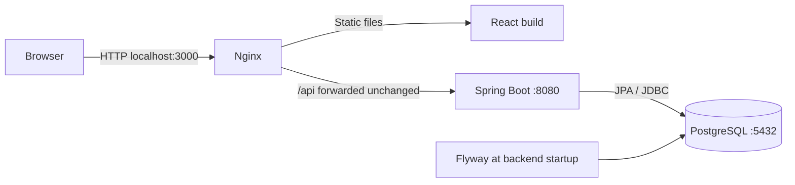
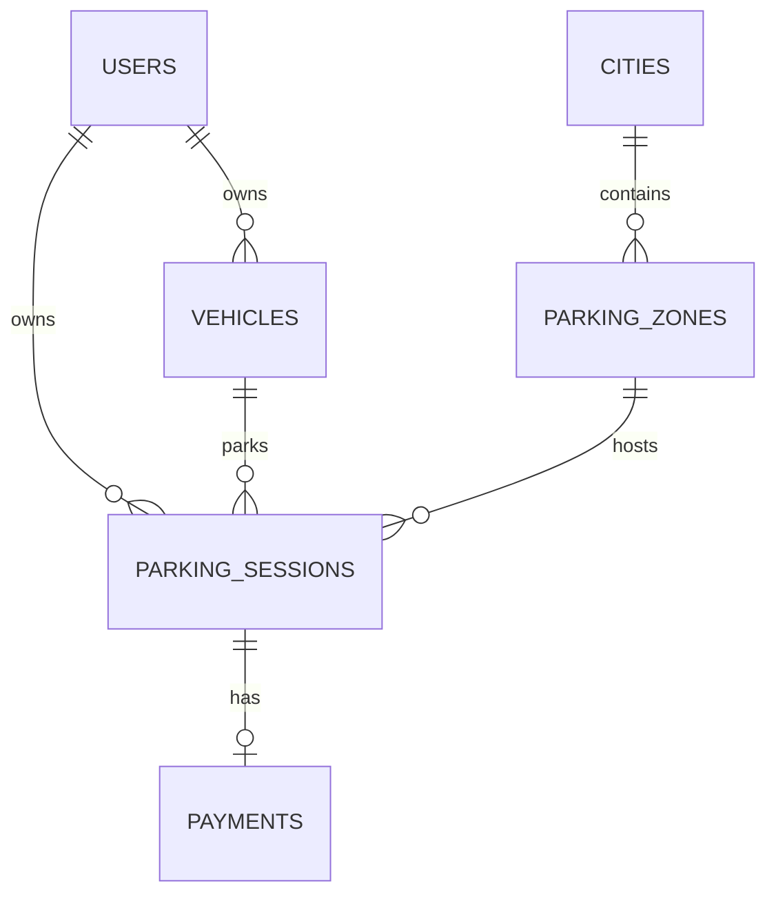

# Architecture

Status: Ready — target design, not an implemented system.

## System boundaries



Keep one repository and three runtime services: `frontend`, `backend`, and `postgres`. React calls relative `/api` paths. The browser never needs Compose service hostnames. Nginx serves the frontend and proxies API requests without removing the `/api` prefix.

## Backend organization

Use a single Spring Boot application and a root Java package such as `com.example.parking`. The final group/package name can be chosen at bootstrap without changing behavior.

```text
backend/src/main/java/com/example/parking/
├── ParkingApplication.java
├── controller/
├── dto/
├── entity/
├── repository/
├── service/
├── exception/
└── config/
```

| Layer | Responsibility |
| --- | --- |
| Controllers | Bind HTTP requests, run request validation, invoke services, return DTOs/status codes |
| Services | Enforce ownership and business rules; own transactions and lifecycle changes |
| Repositories | Queries, persistence, and explicitly declared locking reads |
| Entities | Map the domain to the Flyway-managed schema |
| DTOs | Define public request/response contracts independently of JPA entities |
| Exception handling | Map known failures to the [API error contract](api.md#error-contract) |
| Configuration | Provide the application clock, serialization settings, and infrastructure configuration |

Use constructor injection. Map entities to DTOs inside the service transaction, including read transactions where lazy associations are needed. Disable Open Session in View. Use fetch joins, entity graphs, or projections for list responses when needed to avoid a query for every related vehicle, zone, city, or payment.

Introduce a mapper package only if mapping becomes repetitive. Keep pricing in one `PricingService`; a strategy hierarchy is unnecessary for one charging rule.

## Service responsibilities

| Service | Operations |
| --- | --- |
| `UserService` | List/get demo users; top up a balance |
| `VehicleService` | Get vehicles owned by an existing user |
| `CityService` | List cities |
| `ParkingZoneService` | Get active zones for an existing city |
| `PricingService` | Calculate the final amount from a captured rate and two instants |
| `ParkingService` | Start, list active, stop, and list completed history |
| `PaymentService` | Pay a completed session from its owner's balance |

## Domain relationships



The session's `user_id` must equal its vehicle's owner. It records its zone and a snapshot of the zone's hourly price. A completed session's amount is final. Payment records only successful payment; a rejected attempt creates no row.

## Parking and payment states

| Session status | End time | Amount | Payment record | API payment status |
| --- | --- | --- | --- | --- |
| `ACTIVE` | `null` | `null` | Absent | `null` |
| `COMPLETED` | Present | Present | Absent | `UNPAID` |
| `COMPLETED` | Present | Present | Present, `PAID` | `PAID` |

`UNPAID` is a derived API/display value. It is not a stored payment record or a parking status. There is no transition back to active, no session cancellation, and no refund flow in this prototype.

## Transactions and concurrent requests

`topUp`, `startParking`, `stopParking`, and `pay` each run in a single service transaction. Read endpoints use read-only transactions as appropriate.

For this small prototype, serialize mutations belonging to the same user. Each mutation loads the target user with a pessimistic write lock before reading state used for its decision. Stop and payment then lock the target session and validate ownership and current status. The lock order is always **user, then session**. Start reads the owned vehicle and selected zone after the user lock; it does not need a session lock for a row that does not exist yet.

This deliberately simple policy prevents lost top-ups, competing balance deductions, and conflicting changes to one user's parking state. Different users can mutate independently. Keep transactions short and do not make network calls while holding locks. PostgreSQL locking reads coordinate competing transactions and hold row locks until transaction completion. See the [PostgreSQL locking documentation](https://www.postgresql.org/docs/current/explicit-locking.html).

The schema additionally requires:

- A partial unique index for active sessions on `vehicle_id`.
- A unique constraint on `payments.parking_session_id`.
- Nonnegative money constraints and consistent session state.

Service checks provide useful errors; database constraints protect stored invariants. PostgreSQL supports uniqueness over a selected subset of rows with a partial unique index. See [partial indexes](https://www.postgresql.org/docs/current/indexes-partial.html).

Every balance change must use the shared user-lock convention. Payment checks balance and existing payment only after locking, deducts the exact stored session amount, and inserts the payment in the same transaction. Return success only after transaction commit. A failure must escape the transaction boundary so it rolls back; do not catch it and return success from inside that transaction. Use runtime business exceptions, or explicitly configure rollback for any checked exception that can leave changed state. See [Spring's transaction rollback rules](https://docs.spring.io/spring-framework/reference/data-access/transaction/declarative/rolling-back.html).

Translate recognized uniqueness violations to their documented conflict errors after rollback. Do not translate every database error into a duplicate-parking or duplicate-payment error. An unexpected infrastructure failure remains a generic server error.

## Time and pricing

- Inject `java.time.Clock`, using UTC in the application and a fixed or adjustable clock in tests.
- Use `Instant` in Java and `timestamptz(3)` in PostgreSQL.
- Truncate generated instants to milliseconds before storing or calculating; the persisted precision defines the duration.
- Return ISO 8601 UTC timestamps with a `Z` suffix. The frontend formats them in the browser's timezone and labels that convention.
- Capture `hourlyRate` when starting. Subsequent catalog rate changes cannot change that session's bill.
- Use complete elapsed milliseconds, including any fraction beyond a full hour, with a one-hour minimum. Reject an end time earlier than the start without changing the session.

The exact calculation and examples belong to [the parking lifecycle specification](specs/003-parking-lifecycle.md#pricing).

## Money

All amounts are fictional EUR values. Java uses `BigDecimal`; PostgreSQL uses `numeric(12,2)`. Maximum representable money is `9999999999.99`. Reject an out-of-range top-up request and a top-up that would exceed the balance limit.

Use decimal strings on the wire: `"20.00"`, never floating-point arithmetic for balances or charges. Top-up input is parsed into `BigDecimal` only after validating its decimal form. Responses always have exactly two fractional digits. The frontend sends the input string and displays server amounts; it does not calculate bills, payment eligibility, or new balances with JavaScript arithmetic.

Hourly rates are nonnegative, so a zero-price zone is allowed. A zero-amount completed session can be explicitly paid, producing a payment without changing the balance. The seeded zones all have positive rates.

## Frontend organization

Use React state/effects and native `fetch`. Group user selection, wallet, and parking components in their feature folders. Shared components belong in `components/`; shadcn primitives belong in `components/ui/`. A small API module centralizes requests and errors. The [frontend specification](frontend.md) defines state ownership and refresh behavior.

## Deployment and persistence

Flyway owns all schema and seed changes. Hibernate validates mappings; it never creates or updates tables. Database storage uses a named Compose volume. The frontend exposes port 3000; backend and database communicate on the Compose network. Local development may publish database port 5432 as described in the [development guide](development.md).

Pin dependencies and images during bootstrap and commit the frontend lockfile and Maven wrapper. No CI/CD or production deployment is required.

## Deliberate limits

The demo selector supplies context, not authentication. Catalog edits, ownership transfers, refunds, payment providers, and wallet history are excluded. Stop and payment reject duplicate actions instead of silently succeeding. Top-up has no idempotency key, so a new accepted request adds funds again; the UI must not automatically retry it after an ambiguous network failure.

History is unpaginated for the small demo dataset. Prices are snapshots, while vehicle plates and city/zone names are joined from a catalog that the application cannot edit. Future catalog editing must revisit historical display semantics.
